# K8s-Beginner

This is my K8s Beginner Materials

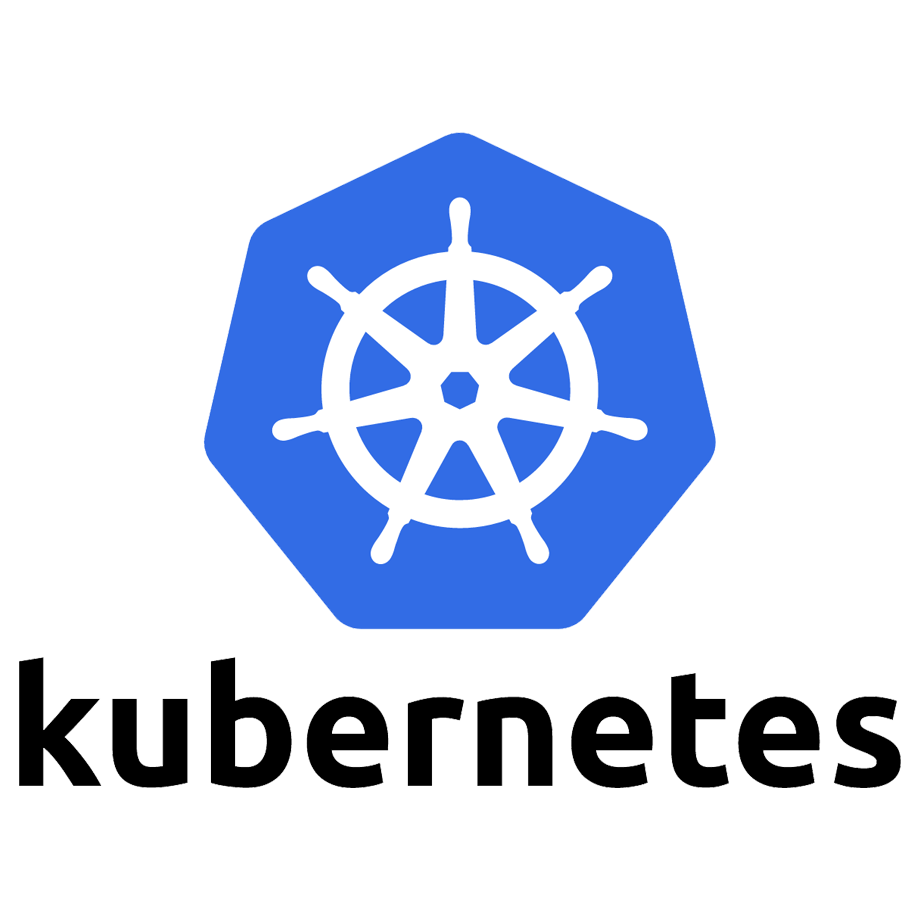

<details>
<summary>Terms and Concepts</summary>

- Node/minions =  A node is a machine, physical or virtual on which Kubernetes is installed.

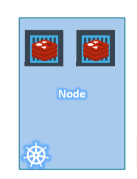

- Cluster = A set of nodes grouped together.

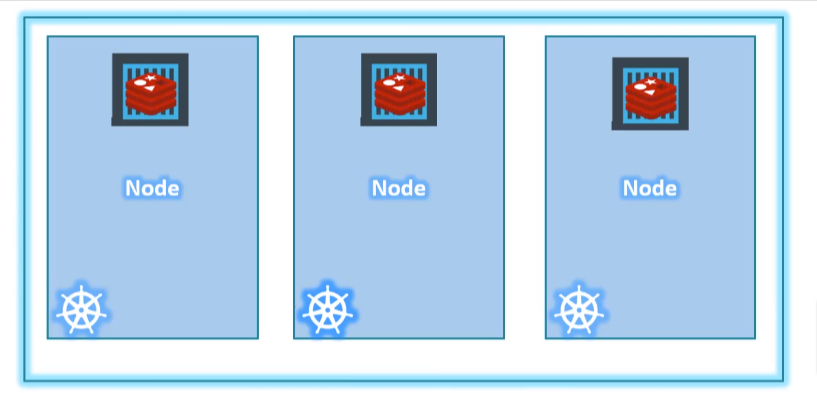

- Master = The Master is another node with Kubernetes installed in it and is configured as a Master.

### Pods = Encapsulate container. It is single instance of an application

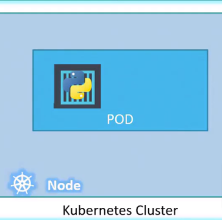

- Cannot have multiple instances (same kind) in side a single pod

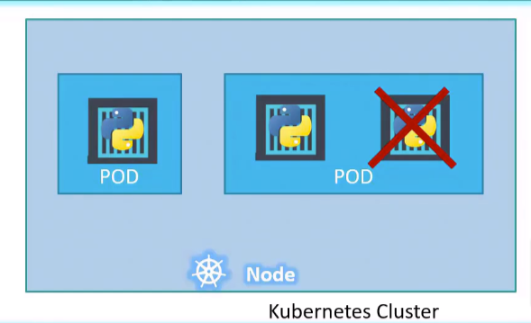

- Can hve multiple instances of (different kind) in a single pod

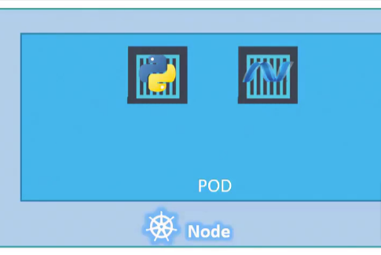

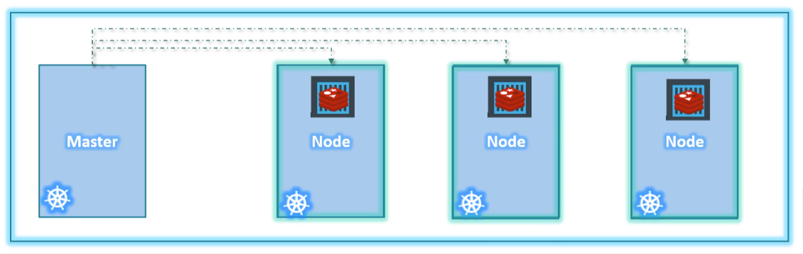

- Deployment = to increase quantity vise verse and to modify configuration

- ReplicaSet =  ensures there is always a stable set of running pods for a specific workload

- Service = method for exposing a network application that is running as one or more Pods in your cluster.

</details>

<br>

<details>

<summary>Kubernetes Architecture / Components</summary>

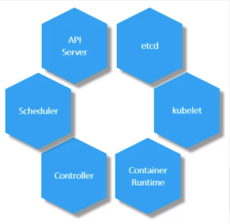

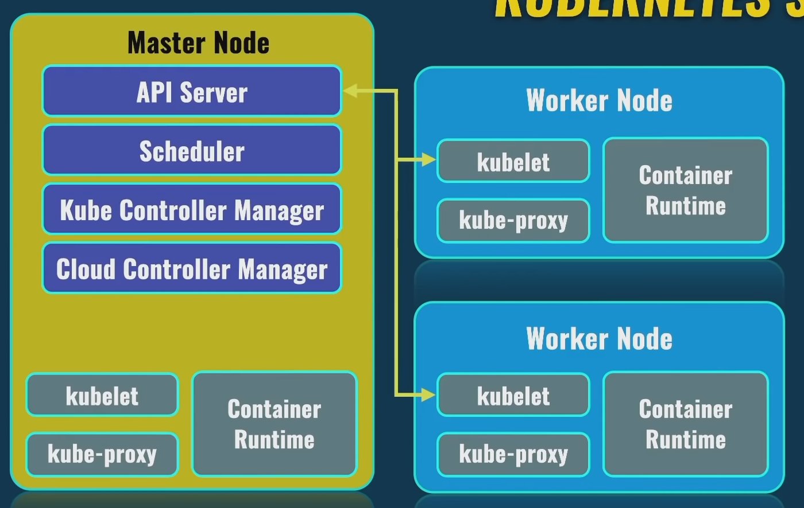

- API Server = acts as the front end for Kubernetes. The users, management devices, command line interfaces

- etcd =  etcd is a distributed reliable key value store used by Kubernetes to store all data used to manage the cluster.

- scheduler = distribute work or container across multiple nodes

- controller = noticing and responding when nodes, containers or endpoints goes down.

- container runtime = underlying software to run containers (docker)

- kubelet agent = interact with master node

</details>

## Kubectl commands

- to get version of kubectl

```bash
kubectl version --client
```

- to create and run a pod

```bash
kubectl run [image_name/pod_name] --image=[docker_image]
```

eg:

```bash
kubectl run apache --image=httpd
```

- to get the status of the pods

```bash
kubectl get pods
```

```bash
kubectl get pods --namespace=[namespace]
```

- to get addition info parameter of the pod

```bash
kubectl get pods -o wide
```

- to get more information of the pod

```bash
kubectl describe pod [pod_name]
```

- to get node info

```bash
kubectl get nodes
```

- to get additional info parameter of node

```bash
kubectl get nodes -o wide
```

- to get cluster info

```bash
kubectl cluster-info
```

- to get namespace

```bash
kubectl get namespace
```

- to delete a pod

```bash
kubectl delete pod [pod_name/image_name]
```

eg:

```bash
 kubectl delete pod apache
```

## Deployment

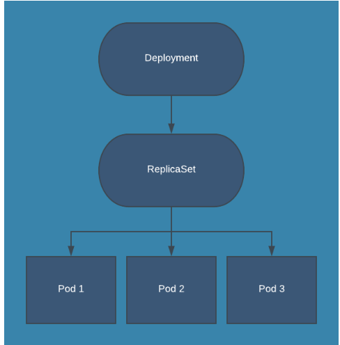

- create deployment

```bash
kubectl create deployment [deploy_name] --image=[image_name]
```

eg:

```bash
kubectl create deployment nginx-deploy --image=nginx
```

- get details of deployment

```bash
kubectl get deployments
```

- get more details of deployment

```bash
kubectl describe deployment [deploy_name]
```

eg:

```bash
kubectl describe deployment nginx-deploy
```

- to increase pods inside a deployment

```bash
kubectl scale deployment [deploy_name] --replicas=[desire_number]
```

eg:

```bash
kubectl scale deployment nginx-deploy --replicas=5
```

- to expose port

```bash
kubectl expose deployment [deploy_name] --port=[host_port_num] --target-port=[container_port_num] 
```

eg:

```bash
kubectl expose deployment nginx-deploy --port=8080 --target-port=80
```

- to delete deployment

```bash
kubectl delete deployment [deploy_name]
```

## Service

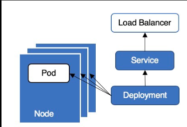

- to list services

```bash
kubectl get services
```

- to delete service

```bash
kubectl delete service [deploy_name]
```

<!-- 
### To deploy and manage applications on kubernetes

- kubectl run hello-minikube = to deploy application on the cluster
- kubectl cluster-info = to view info about the cluster
- kubectl get nodes = to get list of nodes part of the cluster -->

## minikube and kubectl

### minikube is local Kubernetes, focusing on making it easy to learn and develop for Kubernetes (it acts as both master and worker node)

- minikube status

```bash
minikube status
```

- ip address of minikube

```bash
minikube ip 
```

- enter into minikube

```bash
minikube ssh
```

-

## YAML in K8s

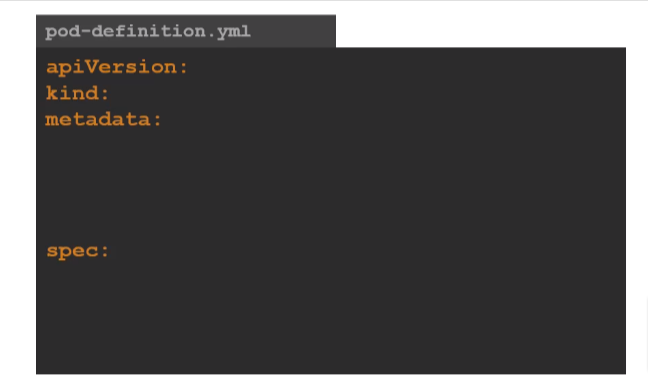
